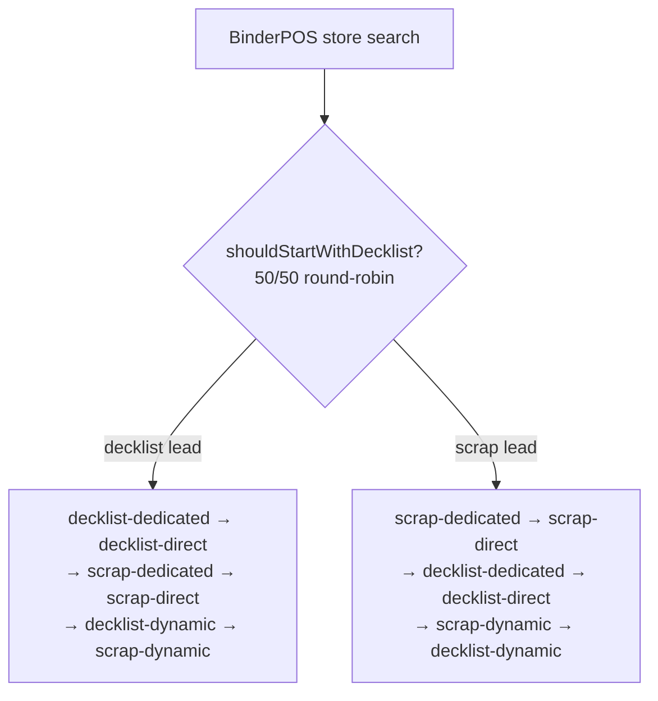

# Gishath Fetch

Gishath Fetch is a web application for Magic: The Gathering players in Singapore to search singles across multiple local game stores (LGS) in parallel.

It aggregates listings from supported stores, normalizes results, and sorts by price so users can quickly find the best available options.

## 🚀 Features

- ⚡ Concurrent search across supported stores
- 🎯 Result filtering and normalization for better match quality
- 💰 Price-first sorting for faster deal discovery
- 🧭 Store filtering (query specific LGS only)
- 🛒 Persistent cart in the frontend UI

## 🏗️ Architecture

- Frontend: React 19 + Vite + Bootstrap (`frontend/`)
- Backend: Go Lambda handler + concurrent scrapers (`api/`)

## 🔎 Search flow

A search request fans out to every selected store in parallel, each store
resolves its own listings, and the results are merged, filtered, and sorted
before being returned.

### Request entry & fan-out

1. The handler parses `s` (the search string, minimum 3 characters) and an
   optional `lgs` filter (comma-separated store names; empty means all stores).
2. The controller instantiates each selected store and runs **one goroutine per
   store**, each bounded by a 20s per-site timeout (`config.PerSiteTimeout`).
3. Each store's results are merged into a shared aggregator. A per-store failure
   is recorded but never blocks the others, so a search returns whatever
   succeeded (partial success).
4. The aggregated cards are filtered and sorted: **in-stock only**, **price
   ascending**, with name-match priority **exact > prefix > partial**. Art cards
   and Japanese-language listings are excluded. A minimum response time (~1s) is
   enforced for a consistent UX.

### Concurrency gates

- At most **12** BinderPOS stores search concurrently (`binderposMaxConcurrent`).
- At most **4** decklist requests hit the shared portal host at once
  (`binderposPortalMaxConcurrent`). Every BinderPOS store's decklist call targets
  the same `portal.binderpos.com`, so this extra gate prevents bursts that
  trigger 429/503 throttling.

### Two kinds of stores

**Non-BinderPOS stores** (e.g. Agora, Cards Central, Cards & Collections,
Dueller's Point, 5 Mana, Mox & Lotus, TCG Marketplace) each implement a single
bespoke `Search` — a custom JSON API call or one HTML scrape — with no
multi-strategy fallback. On failure the store simply contributes nothing.

**BinderPOS stores** (e.g. Card Affinity, Cards Citadel, Flagship, Game's Haven,
Grey Ogre Games, Hideout, Mana Pro, MTG Asia, OneMTG) share one gateway that can
read listings from two sources:

- **Decklist** — a POST to the shared `portal.binderpos.com` decklist endpoint.
- **Scrape** — an HTML scrape of the store's own storefront.

### BinderPOS decklist-vs-scrape 50/50 lead

Each BinderPOS store **leads** its search with either the decklist portal or its
own storefront scrape. The choice is a deterministic round-robin
(`shouldStartWithDecklist`), so across the stores in a single search roughly half
lead with the shared portal and half lead with their own domains. This halves the
first-attempt burst on `portal.binderpos.com`. The family that is not chosen as
the lead still runs as a fallback, and within each family attempts escalate
across proxy tiers (**dedicated → direct → dynamic**), with the dynamic proxy
reserved for last.



Resulting attempt order:

| Lead | Attempt order |
|------|---------------|
| Decklist | `decklist-dedicated` → `decklist-direct` → `scrap-dedicated` → `scrap-direct` → `decklist-dynamic` → `scrap-dynamic` |
| Scrape | `scrap-dedicated` → `scrap-direct` → `decklist-dedicated` → `decklist-direct` → `scrap-dynamic` → `decklist-dynamic` |

Stores without a Shopify domain mapping can only be scraped, so the decklist
portal is skipped entirely: `scrap-dedicated` → `scrap-direct` → `scrap-dynamic`.

### Fallback rules

- The chain advances to the next attempt **on error only**. An empty but
  error-free result counts as success and stops the chain (no further fallback).
- Each attempt is bounded by a 10s timeout (`binderposAttemptTimeout`). The first
  attempt starts immediately; later attempts honor per-domain request pacing.
- The decklist path additionally retries transient portal errors (429/5xx and
  network errors, honoring `Retry-After`) internally before yielding to the next
  attempt in the chain.

## 🗂️ Repository layout

```text
.
|-- api/         # Go backend (Lambda handler, scraping gateways, tests)
|-- frontend/    # React + Vite single-page app
|-- Makefile     # Local helpers for common project tasks
`-- Dockerfile   # Backend container build definition
```

## ✅ Prerequisites

- Node.js 22 (matches CI workflow)
- npm
- Go (version declared in `api/go.mod`)

## 🧪 Tests

From repo root:

```bash
make test
```

Or directly:

```bash
cd api
go clean -testcache
go test -mod=vendor -failfast -timeout 5m ./...
```

## 🌐 Proxy support (rate limiting)

The scraper supports multiple proxies to reduce rate-limiting issues from upstream stores.

## 📜 License

This project is licensed under the MIT License. See [LICENSE](./LICENSE).

---

Gishath Fetch is not affiliated with Wizards of the Coast or any supported local game store.
