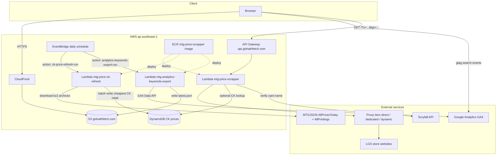
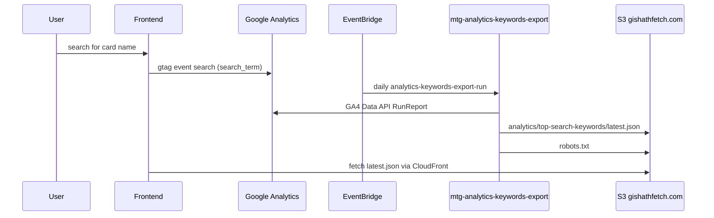
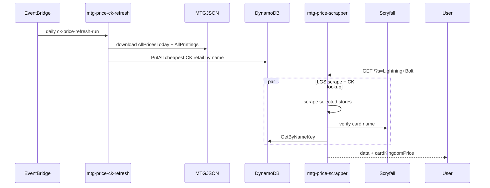
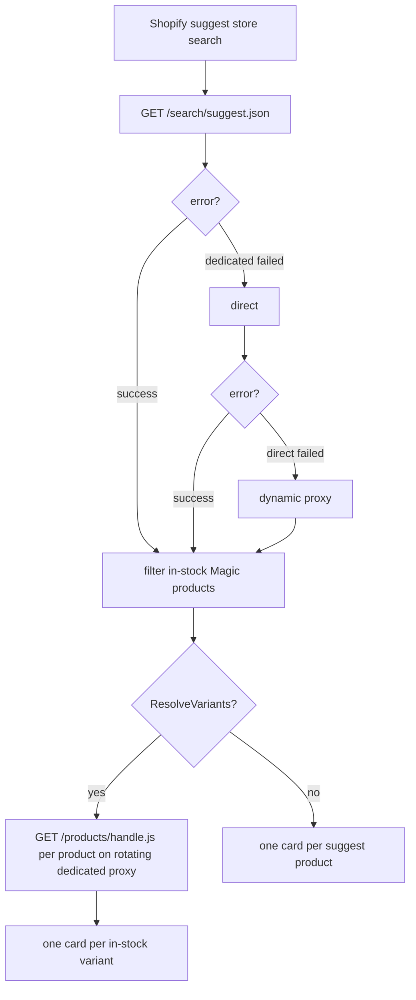
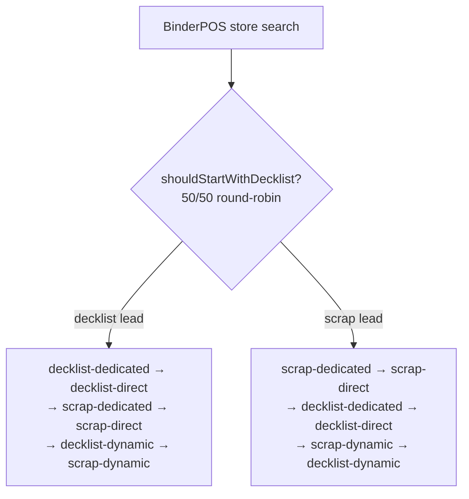

# Gishath Fetch

Gishath Fetch is a web application for Magic: The Gathering players in Singapore to search singles across multiple local game stores (LGS) in parallel.

It aggregates listings from supported stores, normalizes results, and sorts by price so users can quickly find the best available options.

## 🚀 Features

- ⚡ Concurrent search across supported stores
- 🎯 Result filtering and normalization for better match quality
- 💰 Price-first sorting for faster deal discovery
- 🧭 Store filtering (query specific LGS only)
- 🛒 Persistent cart in the frontend UI

## 🏗️ Architecture

- Frontend: React 19 + Vite + Bootstrap (`frontend/`)
- Backend: Go Lambda handlers + concurrent scrapers (`api/`)

### System overview

Gishath Fetch is a static React SPA served from S3 behind CloudFront. Search
requests go through API Gateway to a container-based Lambda that scrapes LGS
sites in parallel. Card Kingdom (CK) retail prices are maintained in DynamoDB by
a separate refresh Lambda on a daily EventBridge schedule; the search Lambda
reads that index when `CK_PRICE_LOOKUP_ENABLED` is set.



### Services

| Service | Name / endpoint | Role |
|---------|-----------------|------|
| Frontend CDN | CloudFront → `gishathfetch.com` | Serves the React SPA from S3 |
| Search API | API Gateway → `api.gishathfetch.com` | Routes `GET /?s=...&lgs=...` to the search Lambda |
| Search Lambda | `mtg-price-scrapper` | Concurrent LGS scraping; optional CK price lookup from DynamoDB |
| CK refresh Lambda | `mtg-price-ck-refresh` | Daily MTGJSON download and DynamoDB index rebuild |
| Analytics keywords Lambda | `mtg-analytics-keywords-export` | Daily GA4 export of top search keywords to S3 |
| Scheduler | EventBridge (`ck-price-refresh-daily`, `analytics-keywords-export-daily`) | Invokes refresh/export Lambdas with action payloads |
| CK price store | DynamoDB (`CK_DYNAMODB_TABLE`) | Cheapest CK retail price per verified card name |
| Container image | ECR `mtg-price-scrapper:latest` | Shared Go binary for all Lambdas (different handlers via event shape) |

### Analytics keywords export flow

The frontend sends GA4 `search` events with a `search_term` parameter whenever a
user starts a valid card-name search (`frontend/src/hooks/useSearch.js`). The
analytics Lambda queries the GA4 Data API for the `search` event and `searchTerm`
dimension, ranks the top 20 keywords for the last 24 hours, 7 days, and 30 days,
and writes JSON to S3.



S3 output (default bucket `gishathfetch.com`, prefix `analytics/top-search-keywords/`):

- `latest.json` — most recent export, served at `https://gishathfetch.com/analytics/top-search-keywords/latest.json`
- `robots.txt` — bucket root; baseline crawl policy plus daily `Allow` lines for top search keywords

The export Lambda writes to the same bucket as the frontend SPA so the report is
available same-origin through CloudFront. The object is uploaded with
`Cache-Control: public, max-age=3600` so edge caches can serve it between daily
exports without a separate invalidation.

Frontend deploys exclude `robots.txt` from `aws s3 sync` so the daily Lambda export
remains the source of truth for the live file.

Example report shape:

```json
{
  "generatedAt": "2026-06-28T12:00:00Z",
  "propertyId": "123456789",
  "eventName": "search",
  "periods": {
    "last24Hours": { "start": "...", "end": "...", "keywords": [{"term": "Opt", "count": 4}] },
    "last7Days": { "startDate": "7daysAgo", "endDate": "today", "keywords": [] },
    "last30Days": { "startDate": "30daysAgo", "endDate": "today", "keywords": [] },
    "last6Months": { "startDate": "2025-12-28", "endDate": "today", "keywords": [] },
    "last1Year": { "startDate": "2025-06-28", "endDate": "today", "keywords": [] }
  }
}
```

### CK price refresh flow

CK prices come from [MTGJSON](https://mtgjson.com/) (official Card Kingdom partner
data), not the Card Kingdom API. The refresh Lambda streams
`AllPricesToday.json.bz2` and `AllPrintings.json.bz2`, picks the cheapest CK
retail listing per card name, and batch-writes the index. Search verifies the
query against Scryfall before looking up DynamoDB and omits stale entries older
than 48 hours.



## 🔎 Search flow

A search request fans out to every selected store in parallel, each store
resolves its own listings, and the results are merged, filtered, and sorted
before being returned.

### Request entry & fan-out

1. The handler parses `s` (the search string, minimum 3 characters) and an
   optional `lgs` filter (comma-separated store names; empty means all stores).
2. The controller instantiates each selected store and runs **one goroutine per
   store**, each bounded by a 16s per-site timeout (`config.PerSiteTimeout`).
3. Each store's results are merged into a shared aggregator. A per-store failure
   is recorded but never blocks the others, so a search returns whatever
   succeeded (partial success).
4. The aggregated cards are filtered and sorted: **in-stock only**, **price
   ascending**, with name-match priority **exact > prefix > partial**. Art cards
   and Japanese-language listings are excluded. A minimum response time (~1s) is
   enforced for a consistent UX.

### Concurrency gates

- At most **12** BinderPOS stores search concurrently (`binderposMaxConcurrent`).
- At most **4** decklist requests hit the shared portal host at once
  (`binderposPortalMaxConcurrent`). Every BinderPOS store's decklist call targets
  the same `portal.binderpos.com`, so this extra gate prevents bursts that
  trigger 429/503 throttling.

### Three kinds of stores

**Non-BinderPOS stores** (e.g. Agora, Cards Central, Cards & Collections,
Dueller's Point, 5 Mana, Mox & Lotus, TCG Marketplace) each implement a single
bespoke `Search` — a custom JSON API call or one HTML scrape — with no
multi-strategy fallback. On failure the store simply contributes nothing.

**Shopify suggest stores** (Fyendal Hobby, MTG Asia, Grey Ogre Games) query each
storefront's Shopify predictive search endpoint (`/search/suggest.json`) through
a shared gateway. Results are filtered to in-stock Magic singles and mapped into
cards using store-specific title/tag conventions (Fyendal Hobby additionally
scopes suggest to its MTG singles product type). On error the chain advances
through proxy tiers (**dedicated → direct → dynamic**); an empty but error-free
response counts as success and stops the chain. Each attempt is bounded by a 10s
timeout (`suggestAttemptTimeout`).

MTG Asia, Grey Ogre Games, and Fyendal Hobby additionally **resolve variants** for the first five suggest products: a follow-up request to `/products/<handle>.js` emits one card
per in-stock variant with the variant's real price and condition. Shopify's
predictive search only reports a product-level `price_min` (the cheapest variant
regardless of stock), so variant resolution ensures the cheapest *purchasable*
price is reported. If the detail request fails, the suggest card is kept as a
resilience fallback.



**BinderPOS stores** (e.g. Card Affinity, Cards Citadel, Flagship, Game's Haven,
Hideout, Mana Pro, OneMTG) share one gateway that can read listings from two
sources:

- **Decklist** — a POST to the shared `portal.binderpos.com` decklist endpoint.
- **Scrape** — an HTML scrape of the store's own storefront.

### BinderPOS decklist-vs-scrape 50/50 lead

Each BinderPOS store **leads** its search with either the decklist portal or its
own storefront scrape. The choice is a deterministic round-robin
(`shouldStartWithDecklist`), so across the stores in a single search roughly half
lead with the shared portal and half lead with their own domains. This halves the
first-attempt burst on `portal.binderpos.com`. The family that is not chosen as
the lead still runs as a fallback, and within each family attempts escalate
across proxy tiers (**dedicated → direct → dynamic**), with the dynamic proxy
reserved for last.



Resulting attempt order:

| Lead | Attempt order |
|------|---------------|
| Decklist | `decklist-dedicated` → `decklist-direct` → `scrap-dedicated` → `scrap-direct` → `decklist-dynamic` → `scrap-dynamic` |
| Scrape | `scrap-dedicated` → `scrap-direct` → `decklist-dedicated` → `decklist-direct` → `scrap-dynamic` → `decklist-dynamic` |

Stores without a Shopify domain mapping, or with `ScrapOnly` set, skip the decklist
portal and only scrape: `scrap-dedicated` → `scrap-direct` → `scrap-dynamic`.

### Fallback rules

- The chain advances to the next attempt **on error only**. An empty but
  error-free result counts as success and stops the chain (no further fallback).
- Each attempt is bounded by a 10s timeout (`binderposAttemptTimeout`). The first
  attempt starts immediately; later attempts honor per-domain request pacing.
- The decklist path additionally retries transient portal errors (429/5xx and
  network errors, honoring `Retry-After`) internally before yielding to the next
  attempt in the chain.

## 🗂️ Repository layout

```text
.
|-- api/         # Go backend (Lambda handler, scraping gateways, tests)
|-- frontend/    # React + Vite single-page app
|-- Makefile     # Local helpers for common project tasks
`-- Dockerfile   # Backend container build definition
```

## ✅ Prerequisites

- Node.js 22 (matches CI workflow)
- npm
- Go (version declared in `api/go.mod`)

## 🧪 Tests

From repo root:

```bash
make test
```

Or directly:

```bash
cd api
go clean -testcache
go test -mod=vendor -failfast -timeout 5m ./...
```

## 🌐 Proxy support (rate limiting)

The scraper supports multiple proxies to reduce rate-limiting issues from upstream stores.

## 📜 License

This project is licensed under the MIT License. See [LICENSE](./LICENSE).

---

Gishath Fetch is not affiliated with Wizards of the Coast or any supported local game store.
