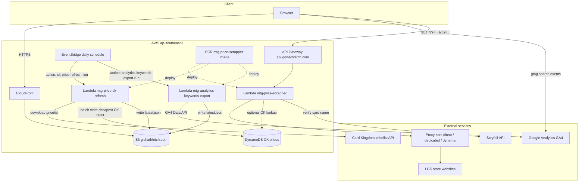
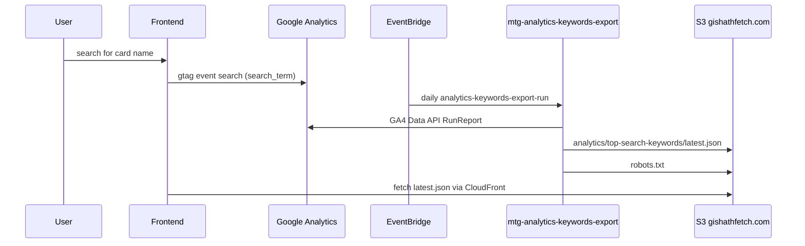
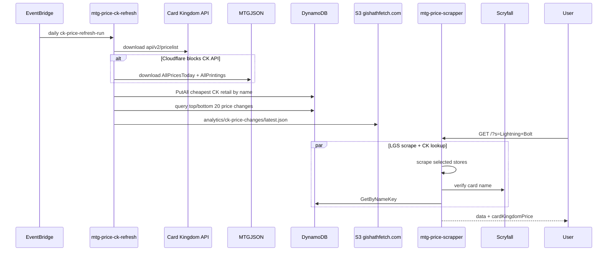
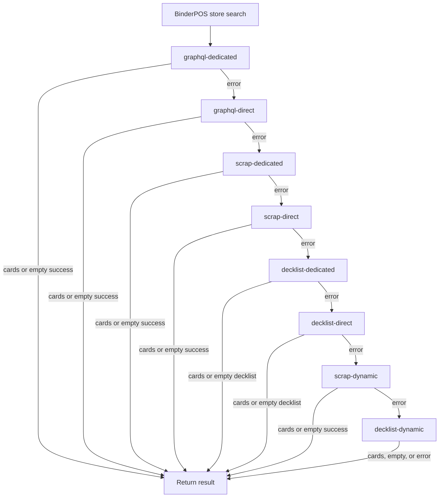

# Gishath Fetch

Gishath Fetch is a web application for Magic: The Gathering players in Singapore to search singles across multiple local game stores (LGS) in parallel.

It aggregates listings from supported stores, normalizes results, and sorts by price so users can quickly find the best available options.

## 🚀 Features

- ⚡ Concurrent search across supported stores
- 🎯 Result filtering and normalization for better match quality
- 💰 Price-first sorting for faster deal discovery
- 🧭 Store filtering (query specific LGS only)
- 🛒 Persistent cart in the frontend UI

## 🏗️ Architecture

- Frontend: React 19 + Vite + Bootstrap (`frontend/`)
- Backend: Go Lambda handlers + concurrent scrapers (`api/`)

### System overview

Gishath Fetch is a static React SPA served from S3 behind CloudFront. Search
requests go through API Gateway to a container-based Lambda that scrapes LGS
sites in parallel. Card Kingdom (CK) retail prices are maintained in DynamoDB by
a separate refresh Lambda on a daily EventBridge schedule; the search Lambda
reads that index when `CK_PRICE_LOOKUP_ENABLED` is set.



### Services

| Service | Name / endpoint | Role |
|---------|-----------------|------|
| Frontend CDN | CloudFront → `gishathfetch.com` | Serves the React SPA from S3 |
| Search API | API Gateway → `api.gishathfetch.com` | Routes `GET /?s=...&lgs=...` to the search Lambda |
| Search Lambda | `mtg-price-scrapper` | Concurrent LGS scraping; optional CK price lookup from DynamoDB |
| CK refresh Lambda | `mtg-price-ck-refresh` | Daily Card Kingdom pricelist download, DynamoDB index rebuild, and CK price change export to S3 |
| Analytics keywords Lambda | `mtg-analytics-keywords-export` | Daily GA4 export of top search keywords to S3 |
| Scheduler | EventBridge (`ck-price-refresh-daily`, `analytics-keywords-export-daily`) | Invokes refresh/export Lambdas with action payloads |
| CK price store | DynamoDB (`CK_DYNAMODB_TABLE`) | Cheapest CK retail price per verified card name |
| Container image | ECR `mtg-price-scrapper:latest` | Shared Go binary for all Lambdas (different handlers via event shape) |

### Analytics keywords export flow

The frontend sends GA4 `search` events with a `search_term` parameter whenever a
user starts a valid card-name search (`frontend/src/hooks/useSearch.js`). The
analytics Lambda queries the GA4 Data API for the `search` event and `searchTerm`
dimension, ranks the top 20 keywords for the last 24 hours, 7 days, and 30 days,
and writes JSON to S3.



S3 output (default bucket `gishathfetch.com`, prefix `analytics/top-search-keywords/`):

- `latest.json` — most recent export, served at `https://gishathfetch.com/analytics/top-search-keywords/latest.json`
- `robots.txt` — bucket root; baseline crawl policy plus daily `Allow` lines for top search keywords

The export Lambda writes to the same bucket as the frontend SPA so the report is
available same-origin through CloudFront. The object is uploaded with
`Cache-Control: public, max-age=3600` so edge caches can serve it between daily
exports without a separate invalidation.

Frontend deploys exclude `robots.txt` from `aws s3 sync` so the daily Lambda export
remains the source of truth for the live file.

Example report shape:

```json
{
  "generatedAt": "2026-06-28T12:00:00Z",
  "propertyId": "123456789",
  "eventName": "search",
  "periods": {
    "last24Hours": { "start": "...", "end": "...", "keywords": [{"term": "Opt", "count": 4}] },
    "last7Days": { "startDate": "7daysAgo", "endDate": "today", "keywords": [] },
    "last30Days": { "startDate": "30daysAgo", "endDate": "today", "keywords": [] },
    "last6Months": { "startDate": "2025-12-28", "endDate": "today", "keywords": [] },
    "last1Year": { "startDate": "2025-06-28", "endDate": "today", "keywords": [] }
  }
}
```

### CK price refresh flow

CK prices prefer Card Kingdom's public pricelist API
(`https://api.cardkingdom.com/api/v2/pricelist`) and fall back to MTGJSON when
Cloudflare blocks the pricelist download (common from AWS Lambda). The refresh
Lambda picks the cheapest listed retail price per card name and batch-writes the
index. Search verifies the query against Scryfall before looking up DynamoDB and
omits stale entries older than 48 hours.



S3 output (default bucket `gishathfetch.com`, prefix `analytics/ck-price-changes/`):

- `latest.json` — most recent export of the top 20 CK price increases and decreases, overwritten on each daily run

The export Lambda writes to the same bucket as the frontend SPA so the report can be served same-origin through CloudFront when needed. The object is uploaded with `Cache-Control: public, max-age=3600`.

Example report shape:

```json
{
  "generatedAt": "2026-07-11T12:00:00Z",
  "syncedAt": "2026-07-11T00:00:00Z",
  "rankingLimit": 20,
  "top": [{"nameKey": "lightning bolt", "cardName": "Lightning Bolt", "priceUsd": 1.25, "priceChangePercent": 15}],
  "bottom": [{"nameKey": "counterspell", "cardName": "Counterspell", "priceUsd": 0.75, "priceChangePercent": -10}]
}
```

#### IAM permissions for `mtg-price-ck-refresh`

The shared `lambda-mtg` role must allow:

- `s3:PutObject` on the export prefix (`arn:aws:s3:::gishathfetch.com/analytics/ck-price-changes/*`)
- `dynamodb:Query` on both CK price-change GSIs:
  - `arn:aws:dynamodb:ap-southeast-1:206363131200:table/gishathfetch-ck-prices/index/priceChangePercent-index`
  - `arn:aws:dynamodb:ap-southeast-1:206363131200:table/gishathfetch-ck-prices/index/priceChangeUsd-index`

The daily export ranks top/bottom price changes by USD (`priceChangeUsd-index`). If that GSI is missing from the role policy, the Lambda fails after the DynamoDB refresh with `AccessDeniedException` on `dynamodb:Query`.

Example inline policy statement to add (merge with existing DynamoDB permissions on the role):

```json
{
  "Effect": "Allow",
  "Action": "dynamodb:Query",
  "Resource": [
    "arn:aws:dynamodb:ap-southeast-1:206363131200:table/gishathfetch-ck-prices/index/priceChangePercent-index",
    "arn:aws:dynamodb:ap-southeast-1:206363131200:table/gishathfetch-ck-prices/index/priceChangeUsd-index"
  ]
}
```

## 🔎 Search flow

A search request fans out to every selected store in parallel, each store
resolves its own listings, and the results are merged, filtered, and sorted
before being returned.

### Request entry & fan-out

1. The handler parses `s` (the search string, minimum 3 characters) and an
   optional `lgs` filter (comma-separated store names; empty means all stores).
2. The controller instantiates each selected store and runs **one goroutine per
   store**, each bounded by a 20s per-site timeout (`config.PerSiteTimeout`).
3. Each store's results are merged into a shared aggregator. A per-store failure
   is recorded but never blocks the others, so a search returns whatever
   succeeded (partial success).
4. The aggregated cards are filtered and sorted: **in-stock only**, **price
   ascending**, with name-match priority **exact > prefix > partial**. Art cards
   and Japanese-language listings are excluded. A minimum response time (~1s) is
   enforced for a consistent UX.

### Two kinds of stores

**Non-BinderPOS stores** (e.g. Cards Central, Cards & Collections,
Dueller's Point, Mox & Lotus, TCG Marketplace) each implement a single bespoke
`Search` — a custom JSON API call or one HTML scrape — with no multi-strategy
fallback. On failure the store simply contributes nothing.

**5 Mana** is Shopify (Dawn, not BinderPOS). It tries Storefront GraphQL first,
then falls back to a `main-search` HTML section scrape when GraphQL fails.

**BinderPOS stores** (e.g. Card Affinity, Cards Citadel, Flagship, Game's Haven,
Fyendal Hobby, Grey Ogre Games, Hideout, Mana Pro, MTG Asia, OneMTG) share one
gateway. Stores with a configured Storefront access token try **GraphQL first**
(dedicated → direct), then fall back to HTML scrape and BinderPOS decklist
strategies.

### BinderPOS GraphQL, scrape, and decklist fallback chain

When a store has a Storefront access token:

`graphql-dedicated` → `graphql-direct` → `scrap-dedicated` → `scrap-direct` → `decklist-dedicated` → `decklist-direct` → `scrap-dynamic` → `decklist-dynamic`

Without a token, the chain starts at `scrap-dedicated` (same as before). Dynamic
proxy remains reserved for the final scrap/decklist attempts; GraphQL uses
dedicated then direct only.



### Fallback rules

- The chain advances to the next attempt **on error only**. An empty but
  error-free **GraphQL** or **scrape** result counts as success and stops the
  chain. An empty decklist response skips the remaining decklist attempts.
- HTTP **5xx** errors on scrape attempts are final; decklist is not tried when
  the storefront itself is failing. GraphQL failures fall through to HTML scrap.
- Each attempt is bounded by a 5s timeout (`binderposAttemptTimeout`). The first
  attempt starts immediately; later attempts honor per-domain request pacing.
- Decklist calls to `portal.binderpos.com` retry transient 429/5xx responses
  with jittered backoff (honoring `Retry-After`) and share a small concurrency
  gate across stores.

## 🗂️ Repository layout

```text
.
|-- api/         # Go backend (Lambda handler, scraping gateways, tests)
|-- frontend/    # React + Vite single-page app
|-- Makefile     # Local helpers for common project tasks
`-- Dockerfile   # Backend container build definition
```

## ✅ Prerequisites

- Node.js 22 (matches CI workflow)
- npm
- Go (version declared in `api/go.mod`)

## 🧪 Tests

From repo root:

```bash
make test
```

Or directly:

```bash
cd api
go clean -testcache
go test -mod=vendor -failfast -timeout 5m ./...
```

## 🌐 Proxy support (rate limiting)

The scraper supports multiple proxies to reduce rate-limiting issues from upstream stores.

## 📜 License

This project is licensed under the MIT License. See [LICENSE](./LICENSE).

---

Gishath Fetch is not affiliated with Wizards of the Coast or any supported local game store.
