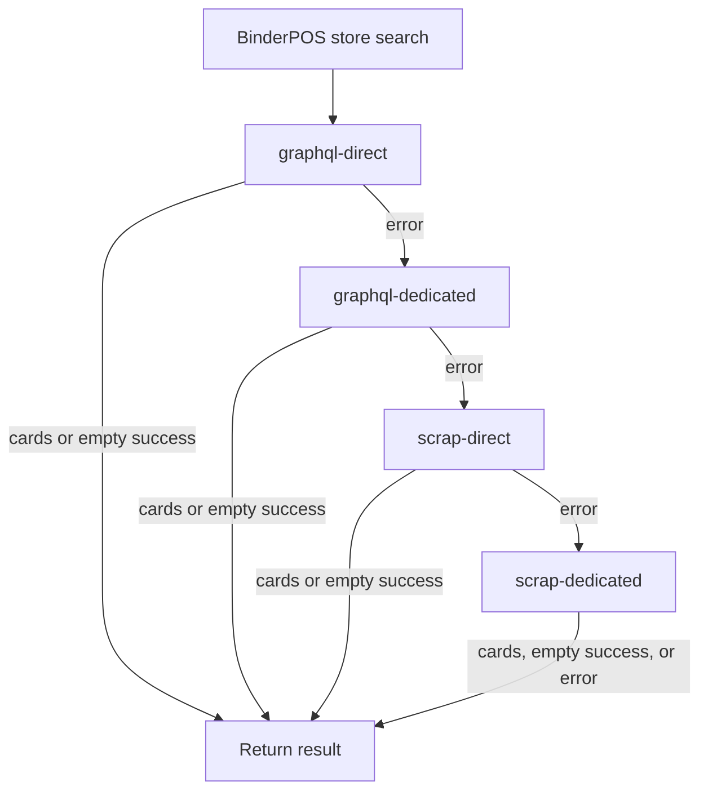

# Gishath Fetch

Gishath Fetch is a web application for Magic: The Gathering players in Singapore to search singles across multiple local game stores (LGS) in parallel.

It aggregates listings from supported stores, normalizes results, and sorts by price so users can quickly find the best available options.

## 🚀 Features

- ⚡ Concurrent search across supported stores
- 🎯 Result filtering and normalization for better match quality
- 💰 Price-first sorting for faster deal discovery
- 🧭 Store filtering (query specific LGS only)
- 🛒 Persistent cart in the frontend UI, sharable across devices via export/import code
- 📈 Trending searches — popular card names by time range (24 hours to 1 year), plus top Card Kingdom price risers and drops (24h)
- 🤖 Telegram bot — `/price` for cheapest in-stock match across stores, with link to full Gishath search

## 🏗️ Architecture

Gishath Fetch has three main layers plus external integrations. Full diagrams,
service tables, batch-job flows, and IAM notes:
[`docs/architecture.md`](docs/architecture.md).

| Layer | Location | Summary |
|-------|----------|---------|
| **Frontend** | `frontend/` | React 19 + Vite + Bootstrap SPA — search UI, cart, trending keywords |
| **Backend** | `api/` | Go Lambda handlers, search controller, per-store scraper gateways |
| **Infrastructure** | AWS ap-southeast-1 | CloudFront, WAF, S3, API Gateway, Lambda, DynamoDB, EventBridge, ECR |

The browser loads the SPA from **S3 via CloudFront** (`gishathfetch.com`). Search
and session call **`api.gishathfetch.com`** (separate CloudFront → API Gateway →
Lambda path). A **Telegram bot** (`mtg-telegram-bot`) receives webhook updates on
a dedicated HTTP API and calls **`GET /telegram/search`** on the search API for
minimal cheapest-card payloads. Daily EventBridge jobs refresh Card Kingdom prices
in DynamoDB and export GA4 trending keywords to S3. Both CloudFront distributions
sit behind **AWS WAF**; inbound API abuse mitigation is documented in
[`docs/api-abuse-mitigation.md`](docs/api-abuse-mitigation.md).

## 🛡️ API abuse mitigation

Inbound `/search`, `/session`, and `/telegram/search` are gated by optional
layers (each off until configured), with **AWS WAF** on both CloudFront
distributions at the edge. The browser uses origin verify + session cookies; the
Telegram bot uses a bearer token on `/telegram/search` (see
[Telegram bot](#-telegram-bot) below).

1. **CloudFront → API origin secret** — Lambda `API_ORIGIN_VERIFY_SECRET`;
   CloudFront (or the Vite dev proxy) injects `X-Origin-Verify` on origin
   requests.
2. **Session token** — `GET /session` mints HttpOnly `gf_api_session`
   (HMAC via `API_SESSION_SECRET`, default TTL 15m); `/search` requires it.

Details, env reference, CloudFront header setup, and the browser sequence
diagram: [`docs/api-abuse-mitigation.md`](docs/api-abuse-mitigation.md).

## 🔎 Search flow

A search request fans out to every selected store in parallel, each store
resolves its own listings, and the results are merged, filtered, and sorted
before being returned. Callers must pass abuse-mitigation checks first (see
above) when those controls are enabled in the environment.

### Request entry & fan-out

1. The handler enforces origin verify and (for `/search`) the session cookie
   when configured, then parses `s` (the search string, minimum 3 characters) and an
   optional `lgs` filter (comma-separated store names; empty means all stores).
2. The controller instantiates each selected store and runs **one goroutine per
   store**, each bounded by a 20s per-site timeout (`config.PerSiteTimeout`).
3. Each store's results are merged into a shared aggregator. A per-store failure
   is recorded but never blocks the others, so a search returns whatever
   succeeded (partial success).
4. The aggregated cards are filtered and sorted: **in-stock only**, **price
   ascending**, with name-match priority **exact > prefix > partial**. Art cards
   and Japanese-language listings are excluded. A minimum response time (~1s) is
   enforced for a consistent UX.

### Two kinds of stores

**Non-BinderPOS stores** (e.g. Agora Hobby, Cards Central, Cards & Collections,
Dueller's Point, Mox & Lotus, The TCG Marketplace) each implement a single
bespoke `Search` — a custom JSON API call or one HTML scrape — with no
multi-strategy fallback chain (5 Mana is an exception; see below). On failure the
store simply contributes nothing.

**5 Mana** is Shopify (Dawn, not BinderPOS). It tries Storefront GraphQL first,
then falls back to a `main-search` HTML section scrape when GraphQL fails.

**BinderPOS stores** (e.g. Arcane Sanctum, Card Affinity, Cards Citadel, Flagship, Game's Haven,
Fyendal Hobby, Grey Ogre Games, Hideout, Hideyoshi, Mana Pro, MTG Asia,
OneMTG) share one gateway. Stores with a configured Storefront access token try
**GraphQL first** (direct → dedicated), then fall back to HTML scrape.

### BinderPOS GraphQL and scrape fallback chain

When a store has a Storefront access token:

`graphql-direct` → `graphql-dedicated` → `scrap-direct` → `scrap-dedicated`

Without a token, the chain starts at `scrap-direct`.

The BinderPOS Decklist API remains implemented under `api/gateway/binderpos/` for
reference and Postman collections, but it is not part of the live search fallback
chain.


```mermaid
flowchart TD
    A[BinderPOS store search] --> G1[graphql-direct]
    G1 -- error --> G2[graphql-dedicated]
    G2 -- error --> B[scrap-direct]
    B -- error --> C[scrap-dedicated]
    G1 -- cards or empty success --> E[Return result]
    G2 -- cards or empty success --> E
    B -- cards or empty success --> E
    C -- cards, empty success, or error --> E
```

### Fallback rules

- The chain advances to the next attempt **on error only**. An empty but
  error-free **GraphQL** or **scrape** result counts as success and stops the
  chain.
- HTTP **5xx** errors on scrape or GraphQL attempts are final. Other GraphQL
  failures fall through to HTML scrap.
- Each attempt is bounded by a **3s** direct or **5s** dedicated timeout. The first
  attempt starts immediately; later attempts honor per-domain request pacing.

## 🤖 Telegram bot

The Telegram bot is a third client of the search backend (alongside the browser
SPA). Users message a bot on Telegram; it returns the **cheapest in-stock match**
across supported stores and a link to the full Gishath search on the website.

Architecture diagrams and sequence flow:
[`docs/architecture.md`](docs/architecture.md) → *Telegram bot flow*.

### Commands

| Command | Behavior |
|---------|----------|
| `/help` | Usage instructions |
| `/price <card name>` | Cheapest in-stock match across all stores (minimum 3 characters) |

Sending bare `/price` prompts for a card name via ForceReply. In group chats,
only the user who sent `/price` can complete that prompt.

The Telegram command menu registers `/help` only. `/price` is documented in
`/help` but omitted from the menu because Telegram sends menu selections
immediately, before the user can type a card name.

### How it works

1. Telegram POSTs updates to **`mtg-telegram-bot`** at `POST /telegram/webhook`
   (dedicated HTTP API Gateway, separate from the browser search API).
2. The webhook validates `X-Telegram-Bot-Api-Secret-Token` against
   `TELEGRAM_WEBHOOK_SECRET`.
3. For `/price`, the handler replies with “Searching…”, then **asynchronously
   self-invokes** the same Lambda (`action: telegram-price-run`) so the webhook
   returns before the multi-store scrape finishes.
4. The follow-up invocation calls **`GET /telegram/search?s=<query>`** on
   `api.gishathfetch.com`, which runs the same concurrent LGS scrape as the
   website but returns only the cheapest card, result count, store link, and
   per-store errors — not the full card list.
5. The bot sends the formatted reply (photo when available) via Telegram
   `sendMessage` / `sendPhoto`.

Auth uses a shared bearer token (`API_TELEGRAM_BOT_TOKEN`), not browser session
cookies. When `API_ORIGIN_VERIFY_SECRET` is enabled on the search API, the bot
Lambda should set the same value so outbound calls include `X-Origin-Verify`.

Further auth and env reference:
[`docs/api-abuse-mitigation.md`](docs/api-abuse-mitigation.md) → *Telegram bot*.

### Configuration

Set these in Lambda env vars, GitHub Actions secrets, or a local `.env` file
(see [`.env.example`](.env.example); never commit secrets):

| Variable | Where | Purpose |
|----------|-------|---------|
| `TELEGRAM_BOT_TOKEN` | Bot Lambda, deploy | Telegram Bot API token |
| `TELEGRAM_WEBHOOK_SECRET` | Bot Lambda, deploy | Webhook `X-Telegram-Bot-Api-Secret-Token` value |
| `TELEGRAM_WEBHOOK_PUBLIC_URL` | Bot Lambda, deploy | Public webhook URL for Telegram `setWebhook` |
| `API_TELEGRAM_BOT_TOKEN` | Search Lambda + bot Lambda | Bearer token for `GET /telegram/search` |
| `GISHATH_API_BASE_URL` | Bot Lambda / local bot | Search API base URL (default `https://api.gishathfetch.com`) |
| `API_ORIGIN_VERIFY_SECRET` | Bot Lambda (when API uses it) | Outbound `X-Origin-Verify` header to the search API |

Deploy (`make deploy` / GitHub Actions) runs **`make telegram-sync`**, which
builds `api/cmd/telegram-sync` and registers slash commands with Telegram
`setMyCommands`. When `TELEGRAM_WEBHOOK_PUBLIC_URL` and `TELEGRAM_WEBHOOK_SECRET`
are also set, it re-registers the webhook. Without `TELEGRAM_BOT_TOKEN`, deploy
skips command sync.

### Local development

Copy `.env.example` to `.env`, fill in the Telegram variables, then run the
local webhook server (same handler as the Lambda):

```bash
cd api
go run -mod=vendor ./cmd/telegram-bot
```

Defaults: listen on `:8080` (`TELEGRAM_LISTEN_ADDR`), webhook path
`/telegram/webhook` (`TELEGRAM_WEBHOOK_PATH`), health check at `/healthz`.
On startup it registers slash commands and the webhook when
`TELEGRAM_WEBHOOK_PUBLIC_URL` is configured.

Local mode runs `/price` **synchronously** (no Lambda self-invoke). Expose
`:8080` via a tunnel (for example ngrok) and set `TELEGRAM_WEBHOOK_PUBLIC_URL`
to `https://<tunnel-host>/telegram/webhook` so Telegram can deliver updates.

To register commands without running the server:

```bash
make telegram-sync
```

Requires `TELEGRAM_BOT_TOKEN` in the environment.

## 🗂️ Repository layout

```text
.
|-- api/         # Go backend (Lambda handler, scraping gateways, Telegram bot, tests)
|-- api/cmd/telegram-bot/   # Local Telegram webhook server
|-- api/cmd/telegram-sync/  # Register slash commands + webhook (also run on deploy)
|-- docs/        # Maintainer docs (architecture, API abuse mitigation, search strategies, skills)
|-- frontend/    # React + Vite single-page app
|-- Makefile     # Local helpers for common project tasks
`-- Dockerfile   # Backend container build definition
```

## ✅ Prerequisites

- Node.js 22 (matches CI workflow)
- npm
- Go (version declared in `api/go.mod`)

## 🧪 Tests

From repo root:

```bash
make test
```

Or directly:

```bash
cd api
go clean -testcache
go test -mod=vendor -failfast -timeout 5m ./...
```

## 🌐 Proxy support (rate limiting)

The scraper supports multiple proxies to reduce rate-limiting issues from upstream stores.

## 📜 License

This project is licensed under the MIT License. See [LICENSE](./LICENSE).

---

Gishath Fetch is not affiliated with Wizards of the Coast or any supported local game store.
