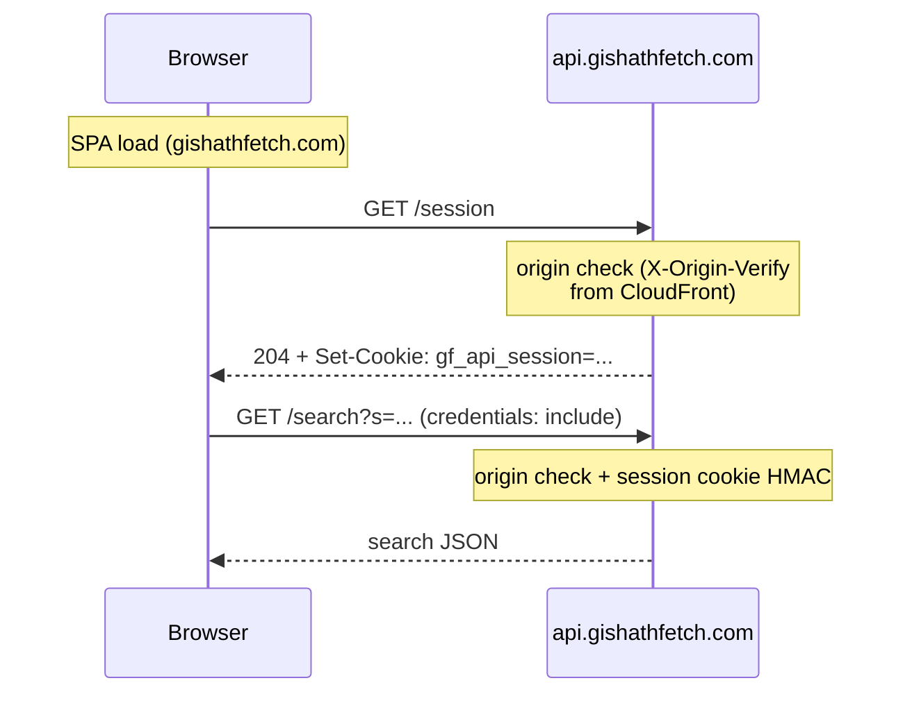

# API abuse mitigation

The search API is public-facing and relatively expensive (parallel LGS scrapes).
Inbound requests are gated by two optional, layered controls:

1. **CloudFront → API origin secret** (`X-Origin-Verify`)
2. **Browser session cookie** (`gf_api_session`)

Each layer is **off until its secret/key is configured**. With none set, `/search`
and `/session` behave as open CORS-allowlisted endpoints (useful for local
Lambda/`go run` testing). In production, enable both together.

For agent-oriented enablement notes (env vars, Vite), see also
[`AGENTS.md`](../AGENTS.md) → *Frontend API connection*.

---

## Request flow (browser)



Production SPA calls go **cross-origin** to `https://api.gishathfetch.com`
(`credentials: "include"`). Frontend CDN CloudFront serves static assets from
S3; it is not on the search path unless you also front API Gateway with
CloudFront and inject the origin-verify header (see below).

---

## 1. CloudFront → API origin secret

**Purpose:** Reject callers that do not arrive through a trusted edge hop (CloudFront
or the Vite dev proxy) that injects a shared secret. When this layer is on, the
execute-api URL cannot be used with a spoofed `Origin` header alone.

| Item | Value |
|------|--------|
| Lambda env | `API_ORIGIN_VERIFY_SECRET` |
| Optional header name override | `API_ORIGIN_VERIFY_HEADER` (default `X-Origin-Verify`) |
| Code | `api/pkg/apiauth/origin.go`, enforced in `handler/search.go` and `handler/session.go` |

When `API_ORIGIN_VERIFY_SECRET` is set, a request passes origin verification when
either:

1. It includes `X-Origin-Verify` (or the configured header) equal to the secret
   (CloudFront origin request or Vite dev proxy), or
2. It arrives on the **API custom domain** (not `*.execute-api.*.amazonaws.com`)
   with an allowlisted `Origin` header (normal browser traffic to
   `api.gishathfetch.com`).

Allowlisted `Origin` alone is **rejected** on execute-api hostnames because it is
trivially spoofed on direct calls that bypass the custom domain.

Otherwise the handler returns **403** (`forbidden`).

### CloudFront setup (API origin)

If CloudFront is configured as a reverse proxy in front of API Gateway (or as a
custom origin for `/api/*` / search paths), add a **custom origin header**:

- Name: `X-Origin-Verify` (unless you override `API_ORIGIN_VERIFY_HEADER`)
- Value: the same string as Lambda `API_ORIGIN_VERIFY_SECRET`

Keep the secret out of the SPA bundle. When CloudFront fronts the API, it can add
this header on the **origin request** to API Gateway (viewers never send it).
Browser calls to `api.gishathfetch.com` also pass via allowlisted `Origin` when
the request hostname is the custom domain.

### Lock down the execute-api URL

Production uses an **HTTP API** (`aws_apigatewayv2_api`). HTTP APIs do **not**
support API Gateway resource policies or IP allowlists the way REST APIs do, so
you cannot block the raw `*.execute-api.*.amazonaws.com` hostname at the gateway
with a CloudFront managed prefix list alone.

With `API_ORIGIN_VERIFY_SECRET` set, direct calls to the execute-api URL are
rejected even with a spoofed allowlisted `Origin`:

```bash
# Bypass attempt — should return 403 forbidden (Origin spoofing is not enough)
curl -i "https://<api-id>.execute-api.ap-southeast-1.amazonaws.com/search?s=Opt" \
  -H "Origin: https://gishathfetch.com"

# Legit path — should work (WAF + origin secret + session as configured)
curl -i "https://api.gishathfetch.com/search?s=Opt" \
  -H "Origin: https://gishathfetch.com" \
  --cookie "gf_api_session=..."
```

**Checklist**

1. `api.gishathfetch.com` DNS points to the **API CloudFront** distribution (not
   directly to API Gateway).
2. CloudFront origin custom header `X-Origin-Verify` matches Lambda
   `API_ORIGIN_VERIFY_SECRET`.
3. `API_ORIGIN_VERIFY_SECRET` is set on Lambda `mtg-price-scrapper`.
4. Verify step 1 with the curl probes above after deploy.

**Stronger options** (optional; not required when the secret + CloudFront path is
in place):

- **Lambda authorizer** on the HTTP API that rejects requests missing the secret
  (blocks before the search Lambda runs; same check, earlier in the chain).
- **REST API + resource policy / API key** via CloudFront (migration; AWS’s
  REST-only pattern for native gateway-side blocking).
- **SigV4 + Lambda@Edge** (AWS security blog “APIProtection” pattern) for IAM-level
  verification.

Do not point `VITE_API_PROXY_TARGET` at the execute-api URL in local dev when
origin verify is enabled — use `https://api.gishathfetch.com` or inject
`VITE_API_ORIGIN_VERIFY_SECRET` via the Vite proxy.

### Local Vite proxy

When `VITE_API_BASE_URL=` (empty), Vite proxies `/search` and `/session` to
`VITE_API_PROXY_TARGET`. Set `VITE_API_ORIGIN_VERIFY_SECRET` in
`frontend/.env.local` so the proxy injects `X-Origin-Verify` (see
`frontend/vite.config.js`).

---

## 2. Session token (`gf_api_session`)

**Purpose:** Require a short-lived, HttpOnly cookie before expensive `/search`
work. Anonymous clients must mint a session first; scripts that skip `/session`
cannot search when this layer is on.

| Item | Value |
|------|--------|
| Lambda env | `API_SESSION_SECRET` (HMAC key) |
| Optional TTL | `API_SESSION_TTL_SECONDS` (default **900** = 15 minutes) |
| Cookie name | `gf_api_session` |
| Cookie attrs | `Path=/`, `HttpOnly`, `SameSite=Lax`, `Secure` when `ENV=prod` |
| Code | `api/pkg/apiauth/session.go`, `api/handler/session.go`, `api/handler/access.go` |

### Minting (`GET /session`)

1. Origin verification (layer 1) must pass.
2. `API_SESSION_SECRET` must be set; otherwise **503** (`session not configured`).
3. Response is **204 No Content** with `Set-Cookie: gf_api_session=...` and
   `Cache-Control: no-store`.

Token format: `expiryUnix.nonce.hmac` (HMAC-SHA256 over `expiry.nonce` with
`API_SESSION_SECRET`).

### Enforcement (`GET /search`)

When `API_SESSION_SECRET` is set, `/search` requires a valid cookie:

| Condition | Response body `error` | Status |
|-----------|----------------------|--------|
| Missing / malformed / bad HMAC | `session required` | 403 |
| Past expiry | `session expired` | 403 |

### Frontend behavior

- `ensureApiSession()` (`frontend/src/utils/apiSession.js`) mints the cookie
  before search (and shares one in-flight mint).
- Background refresh every **10 minutes**
  (`API_SESSION_REFRESH_INTERVAL_MS`) so idle tabs stay under the 15-minute TTL.
- On 403 session errors, search retries once after a forced remint.

---

## Environment reference

| Variable | Where | Default / off | Effect when set |
|----------|--------|---------------|-----------------|
| `API_ORIGIN_VERIFY_SECRET` | Lambda | unset = skip | Require matching `X-Origin-Verify` (CloudFront / Vite proxy) |
| `API_ORIGIN_VERIFY_HEADER` | Lambda | `X-Origin-Verify` | Custom header name for the shared secret |
| `API_SESSION_SECRET` | Lambda | unset = skip session on `/search`; `/session` 503 | Sign/validate `gf_api_session` |
| `API_SESSION_TTL_SECONDS` | Lambda | `900` | Cookie / token lifetime |
| `VITE_API_ORIGIN_VERIFY_SECRET` | Vite only | unset | Proxy injects `X-Origin-Verify` |
| `VITE_API_PROXY_TARGET` | Vite only | `https://api.gishathfetch.com` | Dev proxy target for `/search`, `/session` |
| `VITE_API_BASE_URL` | Frontend | production API host in `constants.js` | Empty string → same-origin paths via Vite proxy |

`config.APIAccessControlEnabled()` is true when origin verify **or** session
secret is configured.

---

## API Gateway routes

Expose **`GET` + `OPTIONS`** for `/search` and `/session` only (legacy `/`,
`/api`, and `/api/*` paths are still accepted by Lambda path routing for
compatibility, but should be removed from the gateway once traffic has
migrated).

CORS allowlist and header policy live in `api/handler/cors.go`.
