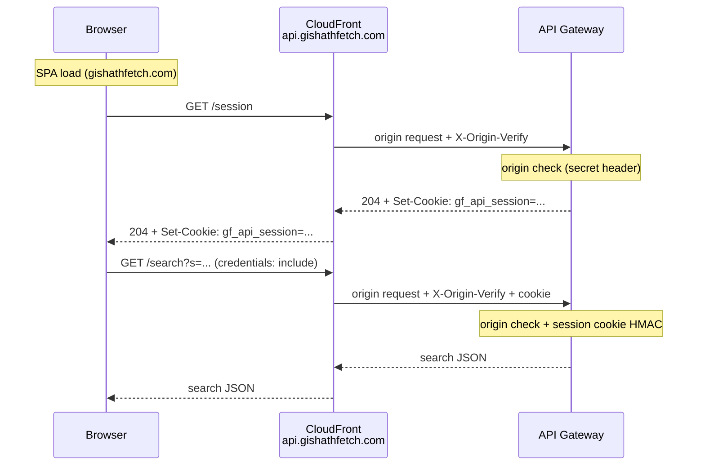

# API abuse mitigation

The search API is public-facing and relatively expensive (parallel LGS scrapes).
Inbound requests are gated by two optional, layered controls:

1. **CloudFront → API origin secret** (`X-Origin-Verify`)
2. **Browser session cookie** (`gf_api_session`)

Each layer is **off until its secret/key is configured**. With none set, `/search`
and `/session` behave as open CORS-allowlisted endpoints (useful for local
Lambda/`go run` testing). In production, enable both together.

Production also attaches **AWS WAF** web ACLs to both public CloudFront
distributions (see [Edge protection](#edge-protection-aws-waf) below).

For agent-oriented enablement notes (env vars, Vite), see also
[`AGENTS.md`](../AGENTS.md) → *Frontend API connection*.

---

## Request flow (browser)



Production SPA calls go **cross-origin** to `https://api.gishathfetch.com`
(`credentials: "include"`). That hostname must resolve to the **API CloudFront**
distribution, which forwards to API Gateway and injects `X-Origin-Verify` on the
origin request. A separate CloudFront distribution serves the static SPA from S3.
Both distributions have **AWS WAF** web ACLs attached at the edge.

---

## Edge protection (AWS WAF)

Production attaches an **AWS WAF** web ACL to each public CloudFront
distribution:

| Distribution | Hostname | Origin | WAF scope |
|--------------|----------|--------|-----------|
| Frontend CDN | `gishathfetch.com` | S3 (`gishathfetch.com` bucket) | Viewer requests to the SPA |
| API CDN | `api.gishathfetch.com` | API Gateway (`execute-api`, origin path `/default`) | Viewer requests to `/search` and `/session` |

WAF evaluates traffic at the CloudFront edge before the request is forwarded to
S3 or API Gateway. Rule groups and rate limits are configured in the AWS console
(or your IaC process); `make deploy` does not manage WAF resources.

Together with origin verify and the session cookie, WAF adds edge filtering
against automated abuse and common web attacks before traffic reaches Lambda.

---

## 1. CloudFront → API origin secret

**Purpose:** Reject direct `execute-api` bypass attempts and other callers that
cannot prove a shared edge secret injected by CloudFront (or the Vite dev proxy).
When this layer is on, the execute-api URL cannot be used with a spoofed
`Origin` header alone.

| Item | Value |
|------|--------|
| Lambda env | `API_ORIGIN_VERIFY_SECRET` |
| Optional header name override | `API_ORIGIN_VERIFY_HEADER` (default `X-Origin-Verify`) |
| Code | `api/pkg/apiauth/origin.go`, enforced in `handler/search.go` and `handler/session.go` |

When `API_ORIGIN_VERIFY_SECRET` is set, a request passes origin verification only
when it includes `X-Origin-Verify` (or the configured header) equal to the secret.
Allowlisted `Origin` alone is **not** accepted — it is trivially spoofed on direct
`execute-api` or custom-domain calls that bypass CloudFront.

Otherwise the handler returns **403** (`forbidden`).

### CloudFront setup (API origin)

`api.gishathfetch.com` must point at a CloudFront distribution that proxies to API
Gateway (typically `execute-api` with origin path `/default`). Add a **custom origin
header** on that origin:

- Name: `X-Origin-Verify` (unless you override `API_ORIGIN_VERIFY_HEADER`)
- Value: the same string as Lambda `API_ORIGIN_VERIFY_SECRET`

Keep the secret out of the SPA bundle. CloudFront adds this header on the **origin
request** to API Gateway; browsers never send it.

### Lock down the execute-api URL

Production uses an **HTTP API** (`aws_apigatewayv2_api`). HTTP APIs do **not**
support API Gateway resource policies or IP allowlists the way REST APIs do, so
you cannot block the raw `*.execute-api.*.amazonaws.com` hostname at the gateway
with a CloudFront managed prefix list alone.

With `API_ORIGIN_VERIFY_SECRET` set, direct calls that bypass CloudFront are
rejected even with a spoofed allowlisted `Origin`:

```bash
# Bypass attempt — execute-api with spoofed Origin (403)
curl -i "https://<api-id>.execute-api.ap-southeast-1.amazonaws.com/search?s=Opt" \
  -H "Origin: https://gishathfetch.com"

# Bypass attempt — API custom domain without CloudFront secret header (403)
curl -i "https://api.gishathfetch.com/search?s=Opt" \
  -H "Origin: https://gishathfetch.com"

# Legit path — browser via CloudFront (session cookie from prior GET /session)
# Manual curl cannot reproduce this without knowing the shared secret.
```

**Checklist**

1. `api.gishathfetch.com` DNS points to the **API CloudFront** distribution (not
   directly to API Gateway).
2. An **AWS WAF** web ACL is associated with the API CloudFront distribution.
3. CloudFront origin custom header `X-Origin-Verify` matches Lambda
   `API_ORIGIN_VERIFY_SECRET`.
4. `API_ORIGIN_VERIFY_SECRET` is set on Lambda `mtg-price-scrapper`.
5. Remove any API Gateway **custom domain** mapping for `api.gishathfetch.com`
   that would allow callers to bypass CloudFront.
6. Verify with the curl probes above after deploy (both bypass attempts return
   403; browser search works).

**Stronger options** (optional; not required when origin verify and the CloudFront
path are in place):

- **Lambda authorizer** on the HTTP API that rejects requests missing the secret
  (blocks before the search Lambda runs; same check, earlier in the chain).
- **REST API + resource policy / API key** via CloudFront (migration; AWS’s
  REST-only pattern for native gateway-side blocking).
- **SigV4 + Lambda@Edge** (AWS security blog “APIProtection” pattern) for IAM-level
  verification.

Do not point `VITE_API_PROXY_TARGET` at the execute-api URL in local dev when
origin verify is enabled — use `https://api.gishathfetch.com` or inject
`VITE_API_ORIGIN_VERIFY_SECRET` via the Vite proxy.

### Local Vite proxy

When `VITE_API_BASE_URL=` (empty), Vite proxies `/search` and `/session` to
`VITE_API_PROXY_TARGET`. Set `VITE_API_ORIGIN_VERIFY_SECRET` in
`frontend/.env.local` so the proxy injects `X-Origin-Verify` (see
`frontend/vite.config.js`).

---

## 2. Session token (`gf_api_session`)

**Purpose:** Require a short-lived, HttpOnly cookie before expensive `/search`
work. Anonymous clients must mint a session first; scripts that skip `/session`
cannot search when this layer is on.

| Item | Value |
|------|--------|
| Lambda env | `API_SESSION_SECRET` (HMAC key) |
| Optional TTL | `API_SESSION_TTL_SECONDS` (default **900** = 15 minutes) |
| Cookie name | `gf_api_session` |
| Cookie attrs | `Path=/`, `HttpOnly`, `SameSite=Lax`, `Secure` when `ENV=prod` |
| Code | `api/pkg/apiauth/session.go`, `api/handler/session.go`, `api/handler/access.go` |

### Minting (`GET /session`)

1. Origin verification (layer 1) must pass.
2. `API_SESSION_SECRET` must be set; otherwise **503** (`session not configured`).
3. Response is **204 No Content** with `Set-Cookie: gf_api_session=...` and
   `Cache-Control: no-store`.

Token format: `expiryUnix.nonce.hmac` (HMAC-SHA256 over `expiry.nonce` with
`API_SESSION_SECRET`).

### Enforcement (`GET /search`)

When `API_SESSION_SECRET` is set, `/search` requires a valid cookie:

| Condition | Response body `error` | Status |
|-----------|----------------------|--------|
| Missing / malformed / bad HMAC | `session required` | 403 |
| Past expiry | `session expired` | 403 |

### Frontend behavior

- `ensureApiSession()` (`frontend/src/utils/apiSession.js`) mints the cookie
  before search (and shares one in-flight mint).
- Background refresh every **10 minutes**
  (`API_SESSION_REFRESH_INTERVAL_MS`) so idle tabs stay under the 15-minute TTL.
- On 403 session errors, search retries once after a forced remint.

---

## Environment reference

Never commit real values for these variables. Set them in Lambda configuration,
GitHub Actions secrets, or a local `.env` file (gitignored). See also
[`docs/architecture.md`](architecture.md) → *Secrets and sensitive configuration*.

| Variable | Where | Default / off | Effect when set |
|----------|--------|---------------|-----------------|
| `API_ORIGIN_VERIFY_SECRET` | Lambda | unset = skip | Require matching `X-Origin-Verify` (CloudFront origin request or Vite dev proxy) |
| `API_ORIGIN_VERIFY_HEADER` | Lambda | `X-Origin-Verify` | Custom header name for the shared secret |
| `API_SESSION_SECRET` | Lambda | unset = skip session on `/search`; `/session` 503 | Sign/validate `gf_api_session` |
| `API_SESSION_TTL_SECONDS` | Lambda | `900` | Cookie / token lifetime |
| `API_MAINTENANCE_MODE` | Lambda | unset/`false` = off | `/search` returns **503**; `/session` advertises maintenance headers |
| `API_MAINTENANCE_MESSAGE` | Lambda | generic unavailable message | User-visible banner text while maintenance mode is on |
| `VITE_API_ORIGIN_VERIFY_SECRET` | Vite only | unset | Proxy injects `X-Origin-Verify` |
| `VITE_API_PROXY_TARGET` | Vite only | `https://api.gishathfetch.com` | Dev proxy target for `/search`, `/session` |
| `VITE_API_BASE_URL` | Frontend | production API host in `constants.js` | Empty string → same-origin paths via Vite proxy |

`config.APIAccessControlEnabled()` is true when origin verify **or** session
secret is configured.

---

## API Gateway routes

Expose **`GET` + `OPTIONS`** for `/search` and `/session` only (legacy `/`,
`/api`, and `/api/*` paths are still accepted by Lambda path routing for
compatibility, but should be removed from the gateway once traffic has
migrated).

Lambda strips common API Gateway stage prefixes before routing (`/prod`,
`/staging`, `/dev`, `/default`). CloudFront origins that target `execute-api`
with origin path `/default` therefore reach `/default/search` and
`/default/session` correctly.

CORS allowlist and header policy live in `api/handler/cors.go`.
