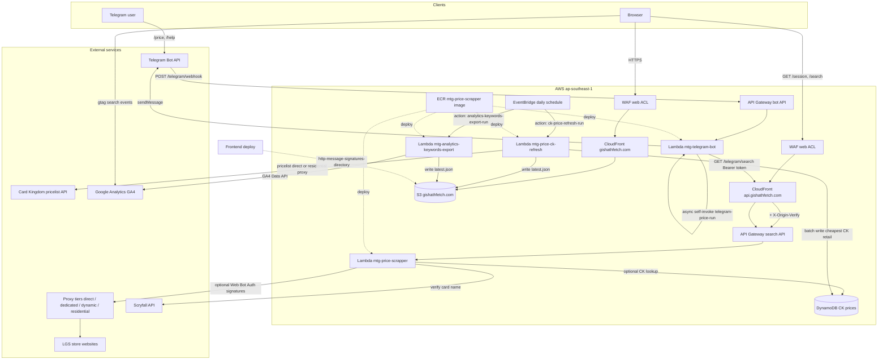
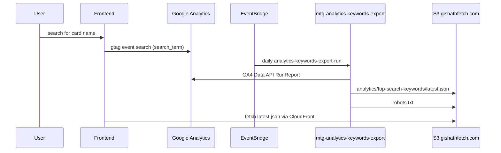
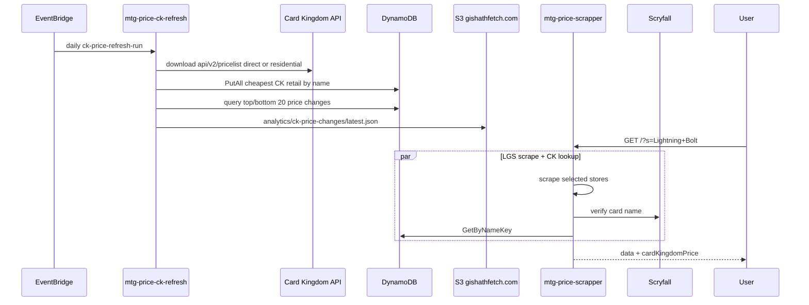
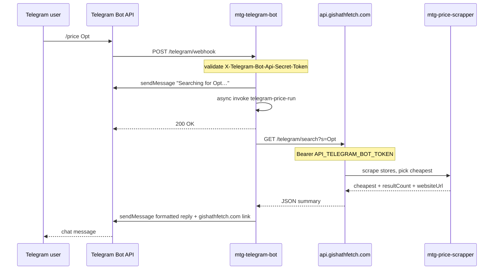

# Architecture

Gishath Fetch is a static React SPA with a serverless Go backend. Search fans out
to multiple local game store (LGS) websites in parallel; scheduled Lambdas maintain
reference data and analytics exports. Everything runs in **AWS ap-southeast-1**.

This document is the maintainer-facing system map. For search strategy details see
[`search-strategies-retries-timeouts.md`](search-strategies-retries-timeouts.md);
for inbound API access control see [`api-abuse-mitigation.md`](api-abuse-mitigation.md).

## Layers

| Layer | Location | Summary |
|-------|----------|---------|
| **Frontend** | `frontend/` | React 19 + Vite + Bootstrap SPA; search UI, cart, trending keywords |
| **Backend** | `api/` | Go Lambda handlers, search controller, per-store scraper gateways |
| **Infrastructure** | AWS | CloudFront, WAF, S3, API Gateway, Lambda, DynamoDB, EventBridge, ECR |
| **External** | — | LGS store sites, proxy tiers, Scryfall, Card Kingdom API, Google Analytics |

### Frontend

- Single-page app built with React 19, Vite, and Bootstrap.
- Calls **`https://api.gishathfetch.com/search`** and **`/session`** (cross-origin,
  credentialed). Local dev can proxy via Vite — see
  [`AGENTS.md`](../AGENTS.md) → *Frontend API connection*.
- Sends GA4 `search` events with a `search_term` parameter on valid card-name
  searches (`frontend/src/hooks/useSearch.js`).
- Fetches trending keyword and CK price-change JSON from same-origin S3 paths
  served through CloudFront (`/analytics/.../latest.json`).
- Persistent cart with export/import for cross-device sharing.

### Backend

- Container-based Lambda (`mtg-price-scrapper`) invoked by API Gateway for
  `GET /search` and `GET /session`.
- Search controller fans out **one goroutine per selected store** (20s per-site
  timeout), merges partial results, filters, and sorts. See README → *Search flow*
  for store types and BinderPOS fallback chains.
- Scraper gateways live under `api/gateway/` — one package per store or store
  family (e.g. BinderPOS, Shopify).
- Optional **Web Bot Auth** outbound signing when `WEB_BOT_AUTH_ENABLED` is set
  ([RFC 9421](https://datatracker.ietf.org/doc/draft-meunier-web-bot-auth-architecture/));
  public key directory at
  `/.well-known/http-message-signatures-directory`.
- Optional Card Kingdom price lookup from DynamoDB when `CK_PRICE_LOOKUP_ENABLED`
  is set; card names verified against Scryfall before lookup.
- Three additional Lambda handlers share the same ECR image and IAM role:
  `mtg-price-ck-refresh` (daily CK pricelist sync),
  `mtg-analytics-keywords-export` (daily GA4 keyword export), and
  `mtg-telegram-bot` (Telegram webhook + async cheapest-card search).
- **`GET /telegram/search`** on the search Lambda returns a minimal payload for the
  bot (bearer token auth via `API_TELEGRAM_BOT_TOKEN`; see
  [`api-abuse-mitigation.md`](api-abuse-mitigation.md) → *Telegram bot*).

### Infrastructure

- **Frontend CDN:** WAF → CloudFront (`gishathfetch.com`) → S3 bucket
  `gishathfetch.com`.
- **API CDN:** WAF → CloudFront (`api.gishathfetch.com`) → API Gateway. CloudFront
  injects `X-Origin-Verify` on origin requests when
  `API_ORIGIN_VERIFY_SECRET` is configured.
- **Compute:** Four container Lambdas from one ECR image (`mtg-price-scrapper:latest`);
  handler selected by event shape (HTTP API request, internal action JSON, or
  EventBridge schedule).
- **Telegram bot API:** HTTP API Gateway → `mtg-telegram-bot` (`POST /telegram/webhook`).
  Search API remains on `api.gishathfetch.com` → `mtg-price-scrapper`
  (`GET /telegram/search` plus browser routes).
- **Data:** DynamoDB table for CK retail prices (`CK_DYNAMODB_TABLE`, default
  `gishathfetch-ck-prices`).
- **Scheduler:** EventBridge rules `ck-price-refresh-daily` and
  `analytics-keywords-export-daily` invoke the refresh/export Lambdas.
- **Deploy:** `make deploy` builds the Docker image, pushes to ECR, updates all
  Lambdas, registers Telegram slash commands when `TELEGRAM_BOT_TOKEN` is set
  (`make telegram-sync`), and syncs the frontend build to S3 (with CloudFront
  invalidation). WAF rules, API Gateway route wiring, and Lambda env secrets are
  managed outside `make deploy`.

Inbound API abuse mitigation (WAF, origin secret, session cookie) is documented in
[`api-abuse-mitigation.md`](api-abuse-mitigation.md).

### External services

| Service | Used by | Purpose |
|---------|---------|---------|
| LGS store websites | Search Lambda | Live inventory listings |
| Proxy tiers (direct / dedicated / dynamic / residential) | Search (+ residential for CK refresh) | Rate-limit and geo mitigation |
| [Scryfall API](https://scryfall.com/docs/api) | Search Lambda | Verify card names before CK lookup |
| [Card Kingdom pricelist API](https://api.cardkingdom.com/api/v2/pricelist) | CK refresh Lambda | Daily retail price index |
| Google Analytics (GA4) | Frontend (events), analytics Lambda (Data API) | Search telemetry and trending keywords |
| [Telegram Bot API](https://core.telegram.org/bots/api) | `mtg-telegram-bot` | Webhook updates, outbound chat replies |

## System diagram



## AWS services

| Service | Name / endpoint | Role |
|---------|-----------------|------|
| Frontend CDN | WAF → CloudFront → `gishathfetch.com` | Serves the React SPA from S3 |
| Web Bot Auth directory | `https://gishathfetch.com/.well-known/http-message-signatures-directory` | Public signing keys; built by `make generate-signature-directory` and uploaded on frontend deploy |
| Search API | WAF → CloudFront → `api.gishathfetch.com` → API Gateway | `GET /search`, `GET /session`, `GET /telegram/search`; origin-verify header; session cookie on browser routes ([docs](api-abuse-mitigation.md)) |
| Search Lambda | `mtg-price-scrapper` | Concurrent LGS scraping; optional Web Bot Auth; optional CK price lookup; `/telegram/search` for bot |
| Telegram bot API | HTTP API Gateway → `mtg-telegram-bot` | `POST /telegram/webhook` (Telegram updates). Optional custom domain (e.g. `bot.gishathfetch.com`). |
| Telegram bot Lambda | `mtg-telegram-bot` | Webhook auth, `/help`, async `/price` via self-invoke → Gishath `/telegram/search` |
| CK refresh Lambda | `mtg-price-ck-refresh` | Daily CK pricelist download, DynamoDB rebuild, price-change export to S3 |
| Analytics keywords Lambda | `mtg-analytics-keywords-export` | Daily GA4 export of top search keywords to S3 |
| Scheduler | EventBridge (`ck-price-refresh-daily`, `analytics-keywords-export-daily`) | Invokes refresh/export Lambdas with action payloads |
| CK price store | DynamoDB (`CK_DYNAMODB_TABLE`) | Cheapest CK retail price per verified card name |
| Container image | ECR `mtg-price-scrapper:latest` | Shared Go binary for all Lambdas (different handlers via event shape) |
| Execution IAM role | `lambda-mtg` | Shared runtime role for all four Lambdas |

## Analytics keywords export flow

The frontend sends GA4 `search` events with a `search_term` parameter whenever a
user starts a valid card-name search. Telegram searches on `GET /telegram/search`
send the same event from the search Lambda via GA4 Measurement Protocol when
`GA4_MEASUREMENT_API_SECRET` is configured. The analytics Lambda queries the GA4 Data API
for the `search` event and `searchTerm` dimension, ranks the top 20 keywords for
the last 24 hours, 7 days, 30 days, 6 months, and 1 year, and writes JSON to S3.



S3 output (default bucket `gishathfetch.com`, prefix `analytics/top-search-keywords/`):

- `latest.json` — most recent export, served at `https://gishathfetch.com/analytics/top-search-keywords/latest.json`
- `robots.txt` — bucket root; baseline crawl policy plus daily `Allow` lines for top search keywords

The export Lambda writes to the same bucket as the frontend SPA so the report is
available same-origin through CloudFront. Objects use `Cache-Control: public,
max-age=3600` so edge caches can serve them between daily exports without a
separate invalidation.

Frontend deploys exclude `robots.txt` from `aws s3 sync` so the daily Lambda export
remains the source of truth for the live file.

Example report shape:

```json
{
  "generatedAt": "2026-06-28T12:00:00Z",
  "propertyId": "123456789",
  "eventName": "search",
  "periods": {
    "last24Hours": { "start": "...", "end": "...", "keywords": [{"term": "Opt", "count": 4}] },
    "last7Days": { "startDate": "7daysAgo", "endDate": "today", "keywords": [] },
    "last30Days": { "startDate": "30daysAgo", "endDate": "today", "keywords": [] },
    "last6Months": { "startDate": "2025-12-28", "endDate": "today", "keywords": [] },
    "last1Year": { "startDate": "2025-06-28", "endDate": "today", "keywords": [] }
  }
}
```

## CK price refresh flow

CK prices are downloaded from Card Kingdom's public pricelist API
(`https://api.cardkingdom.com/api/v2/pricelist`). The download tries direct egress
first, then falls back to a residential proxy when configured. The refresh Lambda
picks the cheapest listed retail price per card name and batch-writes the index.
Search verifies the query against Scryfall before looking up DynamoDB and omits
stale entries older than 48 hours.



S3 output (default bucket `gishathfetch.com`, prefix `analytics/ck-price-changes/`):

- `latest.json` — most recent export of the top 20 CK price increases and decreases, overwritten on each daily run

Example report shape:

```json
{
  "generatedAt": "2026-07-11T12:00:00Z",
  "syncedAt": "2026-07-11T00:00:00Z",
  "rankingLimit": 20,
  "top": [{"nameKey": "lightning bolt", "cardName": "Lightning Bolt", "priceUsd": 1.25, "priceChangeUsd": 0.16}],
  "bottom": [{"nameKey": "counterspell", "cardName": "Counterspell", "priceUsd": 0.75, "priceChangeUsd": -0.08}]
}
```

### IAM permissions for `mtg-price-ck-refresh`

The shared `lambda-mtg` role must allow:

- `s3:PutObject` on the export prefix (`arn:aws:s3:::gishathfetch.com/analytics/ck-price-changes/*`)
- `dynamodb:BatchGetItem`, `dynamodb:BatchWriteItem`, `dynamodb:Scan` on the CK prices **table**:
  - `arn:aws:dynamodb:ap-southeast-1:206363131200:table/gishathfetch-ck-prices`
- `dynamodb:Query` on the CK price-change GSI:
  - `arn:aws:dynamodb:ap-southeast-1:206363131200:table/gishathfetch-ck-prices/index/priceChangeUsd-index`

`BatchWriteItem` covers pricelist upserts and batch **deletes** of rows no longer in the pricelist. `Scan` is required for that cleanup pass. If `Scan` is missing, the Lambda fails after the upsert with `AccessDeniedException` on `dynamodb:Scan`. If the GSI is missing from the role policy, it fails when exporting price changes with `AccessDeniedException` on `dynamodb:Query`.

Example inline policy (merge with existing permissions on the role, or attach as a dedicated inline policy name):

```json
{
  "Version": "2012-10-17",
  "Statement": [
    {
      "Effect": "Allow",
      "Action": [
        "dynamodb:BatchGetItem",
        "dynamodb:BatchWriteItem",
        "dynamodb:Scan"
      ],
      "Resource": "arn:aws:dynamodb:ap-southeast-1:206363131200:table/gishathfetch-ck-prices"
    },
    {
      "Effect": "Allow",
      "Action": "dynamodb:Query",
      "Resource": "arn:aws:dynamodb:ap-southeast-1:206363131200:table/gishathfetch-ck-prices/index/priceChangeUsd-index"
    },
    {
      "Effect": "Allow",
      "Action": "s3:PutObject",
      "Resource": "arn:aws:s3:::gishathfetch.com/analytics/ck-price-changes/*"
    }
  ]
}
```

## Telegram bot flow

The Telegram integration is a separate client path from the browser SPA. Users message
a bot; Telegram POSTs updates to **`mtg-telegram-bot`** (`POST /telegram/webhook` on a
dedicated HTTP API Gateway). The bot Lambda shares the same ECR image and runtime role
as the other handlers; routing is by event shape (webhook HTTP request vs internal
`telegram-price-run` action vs browser/API Gateway requests on `mtg-price-scrapper`).

**Commands**

| Command | Behavior |
|---------|----------|
| `/help` | Usage instructions |
| `/price <card name>` | Cheapest in-stock match across all stores (min 3 characters) |

**Search path:** `/price` triggers the same concurrent LGS scrape as the website, but
via **`GET /telegram/search`** on `mtg-price-scrapper`, which returns only the cheapest
card, result count, store listing URL, and per-store errors — not the full card list.
Auth uses a shared bearer token (`API_TELEGRAM_BOT_TOKEN`), not browser session cookies.

**Async webhook:** Price searches can exceed Telegram's webhook timeout. The webhook
handler acknowledges quickly: it sends a “Searching…” reply, then **asynchronously
self-invokes** the same Lambda with `{action: "telegram-price-run", chatId, query}`.
The follow-up invocation calls Gishath and sends the formatted result via Telegram
`sendMessage`. Code: `api/pkg/telegrambot/`, `api/handler/telegram_webhook.go`,
`api/handler/telegram_search.go`.

The router accepts both REST API (payload 1.0) and HTTP API (payload 2.0) Gateway
events (`api/handler/api_request.go`).



For local development, `api/cmd/telegram-bot` runs the same webhook handler over
HTTP with synchronous `/price` when Lambda self-invoke is unavailable.

**Slash command menu:** `TelegramMenuCommands()` in `api/pkg/telegrambot/commands.go`
registers commands with Telegram `setMyCommands`. `/price` is documented in `/help`
but omitted from the menu because Telegram sends menu selections immediately,
before the user can type a card name. Bare `/price` prompts for a card name via
ForceReply; only the user who sent `/price` can complete that prompt in a group.
Deploy runs `api/cmd/telegram-sync` (`make telegram-sync`) to call
Telegram `setMyCommands`; when `TELEGRAM_WEBHOOK_PUBLIC_URL` and `TELEGRAM_WEBHOOK_SECRET`
are also set, it re-registers the webhook. GitHub Actions passes those env vars from
repository secrets.

## Related docs

- [`api-abuse-mitigation.md`](api-abuse-mitigation.md) — WAF, origin secret, session cookie, env reference
- [`search-strategies-retries-timeouts.md`](search-strategies-retries-timeouts.md) — per-store timeouts, proxy tiers, strategy order
- [`binderpos-search-feature-parity.md`](binderpos-search-feature-parity.md) — BinderPOS gateway feature matrix

## Secrets and sensitive configuration

Nothing in this repository should commit **private keys**, **HMAC/API secrets**, **proxy
passwords**, **Google service-account JSON**, or **Shopify Admin API** credentials.
Those belong in Lambda env vars, GitHub Actions secrets, or a local `.env` file
(gitignored).

### Must stay out of git

| Material | Where it lives | Env / secret name |
|----------|----------------|-------------------|
| API origin-verify secret | Lambda | `API_ORIGIN_VERIFY_SECRET` |
| Search session HMAC key | Lambda | `API_SESSION_SECRET` |
| Web Bot Auth signing key | Lambda / deploy | `WEB_BOT_AUTH_PRIVATE_KEY` or `WEB_BOT_AUTH_PRIVATE_KEY_FILE` |
| Dedicated / residential proxies | Lambda | `DEDICATED_PROXY_*`, `RESIDENTIAL_PROXY_1` |
| TCG Marketplace API token | Lambda | `TCG_MARKETPLACE_ACCESS_TOKEN` |
| Cards Central LGS API key | Lambda | `CARDS_CENTRAL_KEY` |
| GA4 Data API credentials | Lambda | `GA4_PROPERTY_ID`, `GA4_CREDENTIALS_JSON` |
| GA4 Measurement Protocol API secret | Search Lambda | `GA4_MEASUREMENT_API_SECRET` (optional `GA4_MEASUREMENT_ID`) |
| Telegram → Gishath API bearer token | Search Lambda + bot Lambda | `API_TELEGRAM_BOT_TOKEN` |
| Telegram Bot API token | Bot Lambda | `TELEGRAM_BOT_TOKEN` |
| Telegram webhook secret | Bot Lambda | `TELEGRAM_WEBHOOK_SECRET` |
| Local dev origin secret | Vite only | `VITE_API_ORIGIN_VERIFY_SECRET` |
| Google Maps browser API key | Vite / GitHub Actions | `VITE_GOOGLE_MAPS_API_KEY` |
| Deploy role | GitHub Actions | `AWS_DEPLOY_ROLE_ARN` |

The Web Bot Auth **public** key directory is generated at deploy time and uploaded to
S3; the source file `frontend/public/.well-known/http-message-signatures-directory`
is gitignored.

### Intentionally public (not secrets)

| Item | Why it is public |
|------|------------------|
| GA4 measurement ID (`G-…` in `frontend/index.html`) | Embedded in the browser for analytics |
| Google Maps browser API key (`VITE_GOOGLE_MAPS_API_KEY`) | Baked into the SPA at build time; restrict by HTTP referrer in Google Cloud |
| Shopify **Storefront** access tokens in `api/gateway/*/search.go` | Shopify publishes these for client-side Storefront API use; they grant read-only storefront access, not admin |
| AWS account ID / resource ARNs in `Makefile` and IAM examples | Identifiers, not credentials |
| `api.gishathfetch.com`, bucket names, Lambda function names | Public infrastructure endpoints |
